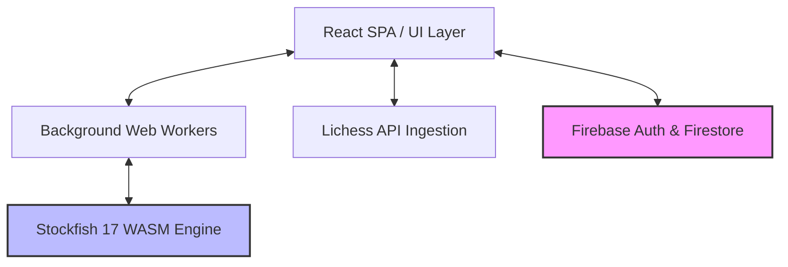

# Chess-OP ♟️📖

<div align="center">
  
  ```
  ________  ___  ___  _______    ________  ________            ________  ________  
 |\   ____\|\  \|\  \|\  _____\ |\   ____\|\   ____\          |\   __  \|\   __  \ 
 \ \  \___|\ \  \\\  \ \  \___/ \ \  \___/\ \  \___/          \ \  \|\  \ \  \|\  \
  \ \  \    \ \   __  \ \  ___ \ \ \_____  \\ \_____  \  ________\ \  \\\  \ \  ___\
   \ \  \____\ \  \ \  \ \  \_/ / \|____|\  \\|____|\  \|\_______\ \  \\\  \ \  \___|
    \ \_______\ \__\ \__\ \_______\  ____\_\  \ ____\_\  \|_______|\ \_______\ \__\   
     \|_______|\|__|\|__|\|_______|\|_________\_________\         \|_______|\|__|   
  ```

  **Enterprise-Grade Chess Analytics & Training Platform**
  
  [](https://chessop.web.app)
  
  [](https://react.dev)
  [](https://vite.dev)
  [](https://firebase.google.com)
  [](https://tailwindcss.com)
  [](https://webassembly.org)

  <p align="center">
    A personalized Spaced Repetition System (SRS) that automatically ingests Lichess match data to isolate and train critical blunders using a local WebAssembly Stockfish engine.
  </p>

</div>

---

## 🚀 Core Features (The "Why")

Chess-OP bridges the gap between passive post-game review and active tactical reinforcement. The platform isolates your actual errors from real matches and transforms them into interactive training material.

*   📥 **Automated Game Ingestion:** Direct integration with the Lichess API allows you to pull your games using a simple wizard. The system parses your history, filters by color or game speed, and flags matches with errors.
*   🤖 **Hybrid Browser-Engine Architecture:** Runs the **Stockfish 17** engine locally in your browser using WebAssembly and Web Workers. This offloads analysis from the server, eliminates processing latency, and ensures absolute user data privacy.
*   🧠 **Dynamic Spaced Repetition System (SRS):** Built-in Leitner-style scheduling queue featuring custom playlists (Recent, History, Archive, Favorites). Utilizes a strict **"First-Try" memory lock**—where only your initial attempt dictates the review interval—and practice mode cooldowns to prevent XP/score farming.
*   ⚔️ **Interactive Training Arena:** Featuring smooth piece dragging, visual move correctness validation (red/green highlighted squares), contextual hints, and full promotion/underpromotion selector support powered by `chessground` and `chess.js`.
*   📊 **Visual Analytics Dashboard:** High-fidelity player dashboard showing blunder heatmaps, opening success rates, custom playlists progress, daily streaks, and XP-based levels tracking your overall improvements.

---

## ⚙️ System Architecture & Security

### Architecture Topology
Chess-OP implements a decoupled client-server architecture designed for high efficiency and zero backend compute costs:



*   **Frontend UI Layer (React 19 & Vite):** Delivers a highly responsive interface with low bundle sizes and Fast Refresh.
*   **Background Workers Layer:** The WebAssembly binary of Stockfish runs on a background worker thread (`stockfish.worker.js`), ensuring that complex tactical calculations and chess search evaluations never block the main UI thread.
*   **Firebase BaaS:** Serves user profiles, SRS playlists, and blunder history in real-time.

### 🛡️ Enterprise Security Model
Data security is enforced directly at the database schema level. In [firestore.rules](file:///C:/Users/ibrah/Desktop/Chess-OP/firestore.rules), we restrict read/write access to user records, puzzles, and activity logs through strict server-side request authorization rules:

```javascript
// Rule structure enforcing authenticated owner access
match /puzzles/{puzzleId} {
  allow read, delete: if isAuthenticated() && resource.data.userId == request.auth.uid;
  allow create: if isAuthenticated() && request.resource.data.userId == request.auth.uid;
  allow update: if isAuthenticated() 
                && resource.data.userId == request.auth.uid 
                && request.resource.data.userId == request.auth.uid;
}
```
*   **No Cross-Tenant Read/Write:** Under no circumstances can one authenticated user query, modify, or delete another user's puzzles or activity logs.
*   **Profile Isolation:** User profile documents `/users/{userId}` can only be queried or mutated by the verified owner (`request.auth.uid == userId`).

---

## 🛠️ Tech Stack

*   **Frontend:** React 19, Vite 7 (using `@vitejs/plugin-react-swc` for ultra-fast SWC compiles), React Router DOM 7
*   **Chess Logic:** `chess.js` (move validation), `chessground` (chessboard component interface)
*   **Engine & Computation:** Stockfish 17 WebAssembly (WASM), HTML5 Web Workers API
*   **Styling & Icons:** Tailwind CSS 3, PostCSS, Autoprefixer, Lucide React
*   **Database & BaaS:** Firebase Auth (Google Sign-In, Password Reset, Email Verification Gates), Cloud Firestore

---

## 💻 Local Setup & Installation

Follow these steps to run Chess-OP locally on your machine:

### Prerequisites
*   [Node.js](https://nodejs.org) (v18.0.0 or higher)
*   `npm` (v9.0.0 or higher)

### Setup Instructions

1.  **Clone the Repository:**
    ```bash
    git clone https://github.com/itsIbrahim03/Chess-OP.git
    cd Chess-OP
    ```

2.  **Install Dependencies:**
    ```bash
    npm install
    ```

3.  **Configure Environment Variables:**
    Create a `.env` file in the project root directory and add your Firebase credentials:
    ```env
    VITE_FIREBASE_API_KEY=your_api_key_here
    VITE_FIREBASE_AUTH_DOMAIN=your_project_id.firebaseapp.com
    VITE_FIREBASE_PROJECT_ID=your_project_id
    VITE_FIREBASE_STORAGE_BUCKET=your_project_id.firebasestorage.app
    VITE_FIREBASE_MESSAGING_SENDER_ID=your_messaging_sender_id
    VITE_FIREBASE_APP_ID=your_app_id
    ```

4.  **Launch Local Development Server:**
    ```bash
    npm run dev
    ```
    The application will launch on your local network, typically at [http://localhost:5173](http://localhost:5173).

---

## 🚀 Deployment

The project is fully compiled for production and deployed serverless using **Firebase Hosting**. 

Deployments are target-oriented and managed through the Firebase CLI:
*   **Build command:** `npm run build`
*   **Deploy command:** `firebase deploy`

Static assets and single-page routing configurations are managed in `firebase.json` and `.firebaserc`.
